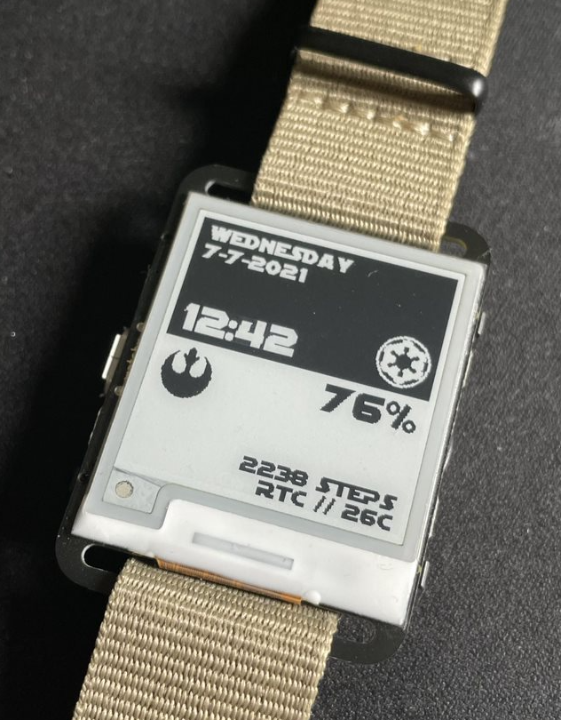

# A Star Wars inspired watchface

Shows the current day, date and time in the top half.

Bottom half shows battery% remaining, stepcount and weather info if wifi is configured (uses RTC ambient temperature as a fallback)

## Minor configuration:

`WEATHER_API_KEY` needs to be set to a valid openweathermap API key.

`WEATHER_LOCATION` needs to be set to a valid openweathermap location.

Configure the offsets in the `configureTime` method to your needs to automatically set the clock using NTP.

See [OpenweatherMap](https://openweathermap.org/api) for more info.